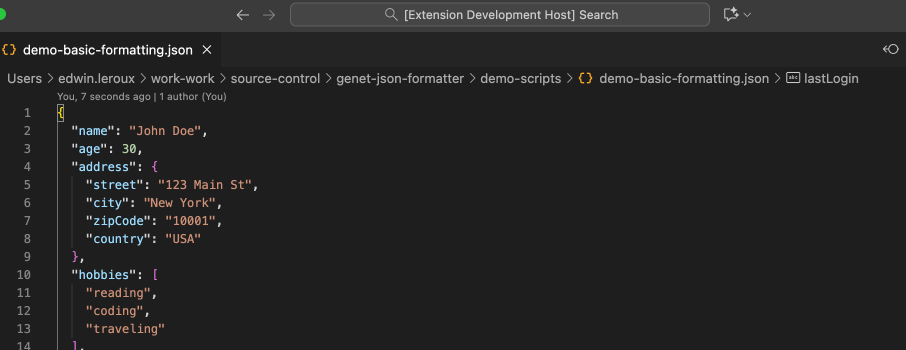
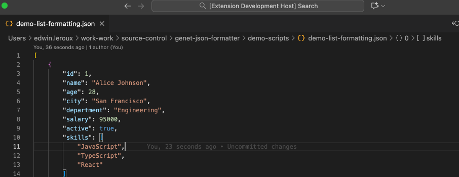
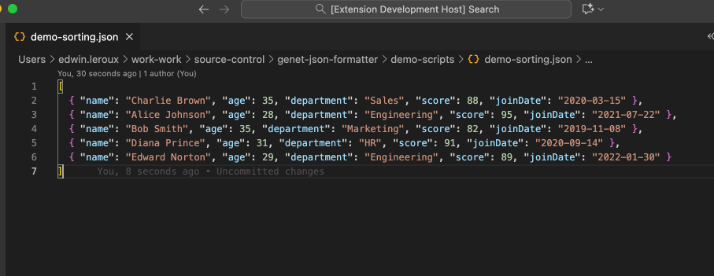

# Genet JSON Formatter

**Complete JSON toolkit with intelligent formatting**

Genet JSON Formatter provides a comprehensive suite of JSON tools with intelligent, adaptive formatting. Keep small objects compact for readability while properly formatting complex structures, plus minification, selection-based formatting, compact list formatting, interactive list sorting, and comprehensive JSON validation.

## 🎬 Feature Demos

### Smart JSON Formatting (`Ctrl+Alt+F`)
Transform messy JSON into beautifully formatted, readable code with intelligent line-length optimization.



*Formats complex nested JSON with perfect indentation and smart single-line optimization*

---

### Compact List Formatting (`Ctrl+Alt+L`)  
Perfect for data arrays where you want each item on its own line for easy scanning.



*Each array item becomes a compact single line - ideal for API responses and data lists*

**Key differences from regular format:**
- **Each array item gets its own line** but stays compact on that line
- **Objects remain single-line** with proper spacing for readability
- **Perfect for data lists, logs, and tabular JSON data**

---

### Interactive Array Sorting (`Ctrl+Alt+S`)
Sort JSON arrays by any property with an intuitive property picker, plus automatic formatting.



*Choose any property to sort by, with smart defaults and mixed-type support*

**Features:**
- **Interactive property picker** - Choose from available object properties  
- **Sort direction selection** - Choose ascending (A→Z, 0→9) or descending (Z→A, 9→0) order
- **Smart defaults** - Uses first property if none selected
- **Primitive value sorting** - Sorts arrays of strings, numbers, booleans by value
- **Mixed-type arrays** - Handles arrays with both objects and primitives (primitives first, then objects by property)
- **Type-aware sorting** - Numbers, strings, mixed types handled correctly
- **Null-safe** - Handles null/undefined values gracefully
- **Auto-formatting** - Applies compact list formatting after sorting

## ✨ Features

### 🎯 **Smart Compact Formatting**
- **Small objects stay on one line** for better readability
- **Large objects get proper indentation** for clarity
- **Configurable size threshold** (default: 100 characters)

### 🔧 **Intelligent Array Handling**
- **Arrays with objects** → Each item on separate lines
- **Simple arrays** → Compact on single line (when small)  
- **Mixed arrays** → Smart formatting based on content

### 📋 **List Formatting Mode**
- **Force each array item on new line** → Perfect for data lists
- **Keep items compact on single line** → Clean tabular appearance
- **Ideal for logs and data arrays** → Maximum scan-ability

### ⚙️ **Fully Configurable**
- **Adjustable line length limit** (10-500 characters)
- **Custom indentation** (1-8 spaces per level)
- **Real-time configuration** - no reload needed

### 🎨 **Enhanced Readability**
- **Proper spacing** in compact objects: `{ "key": "value" }`
- **Clean formatting** with spaces after colons and commas
- **Consistent indentation** for nested structures

### 🔥 **Complete JSON Toolkit**
- **Smart Formatting** → Intelligent compact/expanded formatting
- **JSON Minification** → Ultra-compact single-line output
- **JSON Validation** → Syntax checking with detailed error reporting
- **Selection Support** → Format specific parts of large JSON files
- **Document Formatting** → Integration with VS Code's Format Document (`Shift+Alt+F`)
- **Format on Save** → Automatic formatting when saving JSON files

### 🎯 **Flexible Usage**
- **Format entire documents** or **selected text only**
- **Multiple formatter options** available in VS Code
- **Command Palette access** for all formatting operations
- **Keyboard shortcut support** via Format Document
- **Automatic formatting** with configurable format-on-save

## 🚀 Quick Start

1. **Install** the extension
2. **Open any JSON file**
3. **Choose your formatting method**:

### Method 1: Command Palette
- **Open Command Palette** (`Cmd+Shift+P` / `Ctrl+Shift+P`)
- **Run** `Genet: JSON Format` (smart formatting)
- **Run** `Genet: JSON Minify` (compact single-line)

### Method 2: Format Document (Recommended)
- **Press** `Shift+Alt+F` (Windows/Linux) or `Shift+Option+F` (macOS)
- **Choose** "Genet JSON Formatter" when prompted
- **Set as default** formatter for seamless usage

### Method 3: Format Document With...
- **Command Palette** → `Format Document With...`
- **Select** "Genet JSON Formatter" from the list

### Method 4: Keyboard Shortcuts (Fastest)
- **Format JSON**: `Ctrl+Alt+F` (Windows/Linux) or `Ctrl+Cmd+Option+F` (macOS)
- **Format List**: `Ctrl+Alt+L` (Windows/Linux) or `Ctrl+Cmd+Option+L` (macOS)
- **Sort List**: `Ctrl+Alt+S` (Windows/Linux) or `Ctrl+Cmd+Option+S` (macOS)
- **Minify JSON**: `Ctrl+Alt+M` (Windows/Linux) or `Ctrl+Cmd+Option+M` (macOS)
- **Validate JSON**: `Ctrl+Alt+V` (Windows/Linux) or `Ctrl+Cmd+Option+V` (macOS)
- **Works only in JSON files** for context-aware operation
- **Customizable**: Can be changed in VS Code's Keyboard Shortcuts if needed

### Method 5: Format Selection (Built-in)
- **Select JSON text** you want to format
- **Format Selection**: `Ctrl+K Ctrl+F` (Windows/Linux) or `Cmd+K Cmd+F` (macOS)
- **Uses Genet's smart formatting** on the selected text only

### Method 6: Format on Save (Automatic)
- **Enable** format-on-save in extension settings
- **Save any JSON file** (`Cmd+S` / `Ctrl+S`)
- **Automatic formatting** applied using your configured settings

## ⚙️ Extension Settings

This extension contributes the following settings:

* `genet-json-formatter.maxSingleLineLength`: Maximum character length for objects and arrays to stay on a single line (default: 100, range: 10-500)
* `genet-json-formatter.indentSpaces`: Number of spaces to use for indentation (default: 2, range: 1-8)
* `genet-json-formatter.formatOnSave`: Automatically format JSON files when saving (default: false)

## 🔧 Configuration

### Settings UI
1. **Open Settings** (`Cmd+,` / `Ctrl+,`)
2. **Search** for "Genet JSON Formatter"
3. **Adjust** the settings as needed

### JSON Configuration
Add to your `settings.json`:

```json
{
  "genet-json-formatter.maxSingleLineLength": 150,
  "genet-json-formatter.indentSpaces": 4,
  "genet-json-formatter.formatOnSave": true,
  "[json]": {
    "editor.defaultFormatter": "ecleroux.genet-json-formatter"
  }
}
```

### Format on Save Setup
To enable automatic formatting when saving JSON files:

**Option 1: Settings UI**
1. **Open Settings** (`Cmd+,` / `Ctrl+,`)
2. **Search** "Genet format on save"
3. **Check** "Format On Save" checkbox

**Option 2: JSON Settings**
```json
{
  "genet-json-formatter.formatOnSave": true
}
```

**Note**: Format on save only applies to `.json` files and will safely skip files with invalid JSON syntax.

### Set as Default Formatter
To make Genet your default JSON formatter:
1. **Open a JSON file**
2. **Format Document With...** (`Cmd+Shift+P` → `Format Document With...`)
3. **Choose** "Genet JSON Formatter"
4. **Click** "Configure..." and select "Set as default formatter for JSON files"

## 🎯 Use Cases

### **API Development**
- **Format API responses** for better readability during development
- **Minify JSON** for production payloads to reduce size
- **Debug specific objects** using selection-based formatting

### **Configuration Files**
- **Maintain compact settings** while organizing large configs
- **Format sections** of large config files without affecting others
- **Clean up** messy configuration imports

### **Data Processing**
- **Clean up messy JSON data** with intelligent formatting
- **Process large datasets** by formatting specific sections
- **Prepare data files** for analysis with consistent formatting

### **Code Reviews & Documentation**
- **Make JSON diffs more readable** with consistent formatting
- **Format code examples** in documentation
- **Standardize JSON** across team projects

### **Development Workflow**
- **Automatic formatting** with format-on-save for seamless development
- **Quick minification** for copying compact JSON
- **Selective formatting** when working with large JSON files
- **Integration** with existing VS Code formatting workflows
- **Team consistency** with standardized formatting on every save
- **Error-safe operations** that never break your save process

## 🎮 Available Commands

| Command | Description | Keyboard Shortcut | Usage |
|---------|-------------|-------------------|--------|
| `Genet: JSON Format` | Smart formatting with intelligent compact/expanded layout | `Ctrl+Alt+F` / `Ctrl+Cmd+Option+F` | Command Palette, Format Document, or shortcut |
| `Genet: JSON Format List Compact` | Format arrays with each item on new line as compact single-line objects | `Ctrl+Alt+L` / `Ctrl+Cmd+Option+L` | Command Palette or shortcut |
| `Genet: JSON Sort List` | Sort JSON arrays by any property and format compact with interactive property selection | `Ctrl+Alt+S` / `Ctrl+Cmd+Option+S` | Command Palette or shortcut |
| `Genet: JSON Minify` | Ultra-compact single-line JSON output | `Ctrl+Alt+M` / `Ctrl+Cmd+Option+M` | Command Palette or shortcut |
| `Genet: JSON Validate` | Validate JSON syntax with detailed error reporting | `Ctrl+Alt+V` / `Ctrl+Cmd+Option+V` | Command Palette or shortcut |
| **Format Document** | VS Code's built-in formatter (uses Genet when set as default) | `Shift+Alt+F` / `Shift+Option+F` | Built-in VS Code shortcut, right-click menu |
| **Format Selection** | Format only selected JSON text | `Ctrl+K Ctrl+F` / `Cmd+K Cmd+F` | Built-in VS Code shortcut, right-click menu |

### VS Code Integration Notes
- **Format Document** and **Format Selection** appear in VS Code's right-click context menu when available
- **Custom commands** (`Genet: JSON Format`, `Format List Compact`, `Sort List`, `Minify`, `Validate`) are accessed via Command Palette or keyboard shortcuts
- **No custom context menu items** - integration works through VS Code's built-in formatting system

## 🔌 VS Code Integration

### Document & Range Formatting Providers
- **Format Document** - Integrates with VS Code's Format Document feature (`Shift+Alt+F`)
- **Format Selection** - Integrates with VS Code's Format Selection feature (`Ctrl+K Ctrl+F`)
- **Available** in "Format Document With..." menu and right-click "Format Document"/"Format Selection"
- **Can be set** as default JSON formatter
- **Works with** format-on-save functionality

### Language Support
- **JSON file recognition** (`.json` files)
- **Proper MIME type handling** (`application/json`)
- **Language-specific** configuration options

### Keyboard Shortcuts
- **Context-aware shortcuts** that only work in JSON files
- **Non-conflicting keybindings** designed to work alongside VS Code defaults
- **Cross-platform support** with proper Windows/Linux and macOS variants

| Action | Windows/Linux | macOS |
|--------|---------------|-------|
| **Format JSON** | `Ctrl+Alt+F` | `Ctrl+Cmd+Option+F` |
| **Format List** | `Ctrl+Alt+L` | `Ctrl+Cmd+Option+L` |
| **Sort List** | `Ctrl+Alt+S` | `Ctrl+Cmd+Option+S` |
| **Minify JSON** | `Ctrl+Alt+M` | `Ctrl+Cmd+Option+M` |
| **Validate JSON** | `Ctrl+Alt+V` | `Ctrl+Cmd+Option+V` |

## 🛠️ Technical Features

### Type Safety & Code Quality
- **Full TypeScript implementation** with strict type checking
- **Comprehensive error handling** for invalid JSON
- **Input validation** and bounds checking for configuration
- **Professional code structure** with proper interfaces and constants

### Performance & Reliability
- **Efficient JSON parsing** and formatting algorithms
- **Memory-conscious** handling of large JSON files
- **Progress indicators** for large file operations (>50KB)
- **Robust error recovery** that doesn't break VS Code
- **Optimized** for real-time formatting operations

### Testing & Quality Assurance
- **118 comprehensive unit tests** covering all functionality
- **Sorting algorithm tests** for all array types (objects, primitives, mixed)
- **Edge case testing** (empty arrays, null values, malformed JSON)
- **Performance testing** for large datasets and deep nesting
- **Integration testing** with VS Code APIs and commands
- **Cross-platform validation** ensuring consistent behavior

## 📝 Release Notes

### 1.0.1 - 2025-10-22
- **NEW: JSON List Compact Formatting** - `Genet: JSON Format List Compact` command formats arrays with each item on a single line for optimal data scanning
- **NEW: Interactive Array Sorting** - `Genet: JSON Sort List` command with property selection, ascending/descending direction choice, and automatic compact formatting
- **NEW: Mixed-Type Array Support** - Sort arrays containing both objects and primitives intelligently (primitives first by value, then objects by property)
- **NEW: Sort Direction Control** - Choose ascending (A→Z, 0→9) or descending (Z→A, 9→0) for all sorting operations
- **NEW: Enhanced Keyboard Shortcuts** - Added `Ctrl+Alt+L` for list formatting and `Ctrl+Alt+S` for array sorting
- **ENHANCED: Smart Sorting Algorithm** - Type-aware sorting handles strings, numbers, booleans, null values, and mixed types with proper fallback comparisons
- **ENHANCED: Interactive UI** - Visual property picker with icons and descriptions for intuitive sorting
- **ENHANCED: Comprehensive Testing** - Added 118+ unit tests covering all sorting scenarios, edge cases, and performance validation
- **TECHNICAL: Full TypeScript Safety** - Maintained strict type checking with enhanced error handling for new features

### 1.0.0
- Initial release with comprehensive JSON toolkit
- **Smart compact formatting** with intelligent layout decisions
- **JSON minification** for ultra-compact output
- **JSON validation** with detailed syntax error reporting and position information
- **Selection support** for formatting specific parts of JSON
- **VS Code integration** with Format Document and Format Selection providers
- **Format on save** with configurable automatic formatting
- **Progress indicators** for large file operations to provide user feedback
- **Comprehensive keyboard shortcuts** for formatting (`Ctrl+Alt+F`), minification (`Ctrl+Alt+M`), and validation (`Ctrl+Alt+V`) with macOS variants
- **Full configurability** with line length, indentation, and save behavior settings
- **Type-safe implementation** with comprehensive error handling
- **Professional code structure** with proper TypeScript types
- **Language association** for seamless VS Code integration
- **Error-safe operations** that never interfere with file saving
- **Comprehensive test suite** with 118+ automated tests covering functionality, performance, sorting algorithms, and edge cases

## 🧪 **Testing & Quality Assurance**

### **Comprehensive Test Coverage**
This extension includes a robust testing suite ensuring reliability and performance:

- **🎯 Functional Tests**: 118+ automated tests covering all features including advanced sorting ✅
- **⚡ Performance Tests**: Large file handling (1MB+ JSON) and stress testing ✅
- **🔧 Integration Tests**: Complete VS Code API integration validation ✅
- **🐛 Edge Case Tests**: Invalid JSON, malformed data, and error scenarios ✅
- **📊 Benchmarking**: Performance monitoring and regression detection ✅

### **Test Categories**
- **Core Algorithm Tests**: Smart formatting logic validation
- **VS Code Integration**: Document providers, commands, and configuration
- **Performance Benchmarks**: Large JSON files (1MB+), deep nesting (100+ levels)
- **Error Handling**: Malformed JSON, edge cases, and graceful degradation
- **Memory Management**: Leak detection and concurrent operation testing

For detailed testing documentation, see [TESTING.md](TESTING.md).